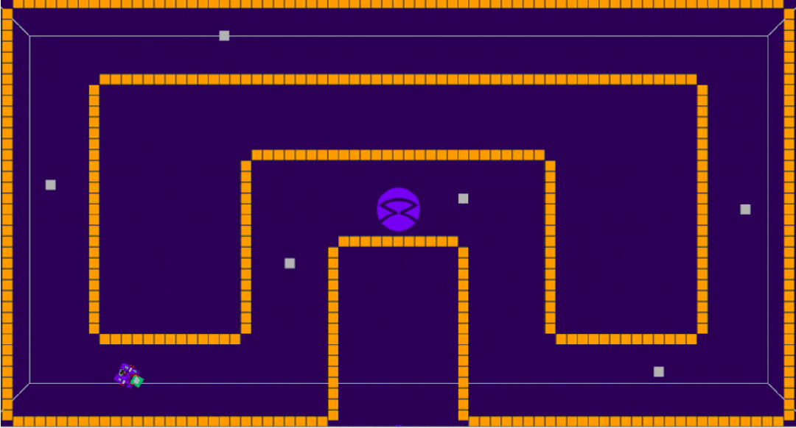

[Research Track II](https://corsi.unige.it/en/off.f/2022/ins/60236)<br>
**Analyser:** [Ankur Kohli](https://github.com/ankurkohli007)<br>
[M.Sc Robotics Engineering](https://corsi.unige.it/corsi/10635)<br>
[University of Genoa (UniGe)](https://unige.it/en)<br>
**Supervisor:** [Prof. Carmine Tommaso Recchiuto](https://rubrica.unige.it/personale/UkNDWV1r)

# Statistical Analysis for Python Robotics Simulator

***Python Robotics Simulator: This is a simple, portable robot simulator. The objective of this assignemt is to develop a Python code script which is capable to behave correctly inside of a given environment. Additionally, this simulator is developed by [Student Robotics](https://studentrobotics.org/)***

## Abstarct

This analysis is about the **statistically analysis** to determine the superiority between two distinct algorithms (my algorithm and professor's algorithm) in accomplishing a specific task. The specific task in this case is a simulation of a robot in a ***pygame*** environment with the objective of completing laps through the designed track (circuit), while occasionally moving silver tokens through its lifting mechanism to a spot behind it, as it makes its way through the circuit. For this analysis, ***Jupyter Notebook*** is used to compute the statistical analysis of the behaviour of two different algorithms for the first assignment of ***Research Track I*** based on ***Python Robotics Simulator***.

## Introduction

Statistical analysis is the collection and interpretation of data in order to uncover patterns and trends. It is a component of data analytics. Statistical analysis can be used in situations like gathering research interpretations, statistical modeling or designing surveys and studies.

In this, the statistical analysis of two implementations (my code and professor code) are going to be studied. The main objective of this analysis is to drive a robot autonomously by grasping the \textit{\textbf{silver token}}, and putting them behind itself, and last but not the least robot should avoids the obstacles, which are \textit{\textbf{golden tokens}}. In figure below, the map of the circuit has been presented as well as the robot itself and tokens are shown.

 

## Description of the analysis

Given the python environment as shown in figure above, the two algorithms – One given by the professor, and one from a student (Which I will refer to as Professor Code and My Code respectively) - compared pass instructions to the robot in the simulated environment to move thought the circuit while grabbing and dropping silver tokens and avoiding golden tokens. A clear indication of performance – considering all environment variables remain constant (token positions and robot starting point) will be the time factor. A measure of the time between each silver token grabbing and releasing events can be measured, as they distinctively define the amount of distance travelled due to their being equally spaced within the environment, and the efficiency of task execution, and overall time taken to lap the circuit. For this experiment, we will consider the results with a level of significant of and above 5%.

For the analysis, clone [my code](https://github.com/ankurkohli007/Research_Track_I_Assignment_1.git) and [professor code](https://github.com/CarmineD8/python_simulator.git). After clonning the given repository, I prepared 4 ".txt" file named as "collision.txt", "collisionp.txt", "trajectory.txt", and "trajectoryp.txt". 

After that, I prepared the Jupyter Code for the Statistical Analysis. For the jupyter code [click here](StatisticsAnalysis.ipynb).

This Jupyter Code will describe the my approach towards the analysis.

## Description of the code

#### Calculating average and standard deviation for analysis

```
# Calculating the average
collision_mean = np.mean(collision)
timestamp_mean = np.mean(timestamp)
collisionp_mean = np.mean(collisionp)
timestampp_mean = np.mean(timestampp)

# Calculating the standard deviation
collision_std = np.std(collision)
timestamp_std = np.std(timestamp)
collisionp_std = np.std(collisionp)
timestampp_std = np.std(timestampp)
```

#### Computing medium using standard deviation

```
# Define labels, positions, bar heights and error bar heights
labels = ['My Code', 'Professor Code']
x_pos1 = np.arange(len(labels))
CTEs1 = [collision_mean, collisionp_mean]
error1 = [collision_std, collisionp_std]

fig1, ax1 = plt.subplots()
ax1.bar(x_pos1, CTEs1,
       yerr=error1,
       align='center',
       alpha=0.75,
       ecolor='black',
       capsize=20)
ax1.set_ylabel('Robot change in direction')
ax1.set_xticks(x_pos1)
ax1.set_xticklabels(labels)
ax1.set_title('Difference between trajectory of My Code and Professor Code')
ax1.yaxis.grid(True)

labels2 = ['My Code', 'Professor Code']
x_pos2 = np.arange(len(labels))
CTEs2 = [timestamp_mean, timestampp_mean]
error2 = [timestamp_std, timestampp_std]

fig2, ax2 = plt.subplots()
ax2.bar(x_pos2, CTEs2,
       yerr=error2,
       align='center',
       alpha=0.75,
       ecolor='black',
       capsize=20)
ax2.set_ylabel('Time (sec)')
ax2.set_xticks(x_pos2)
ax2.set_xticklabels(labels2)
ax2.set_title('Time taken to complete the circuit')
ax2.yaxis.grid(True)

plt.show()
```
#### Collision Test Graphical Representation

```
x=[]
for i in range(1,31):
    x.append(i)
print(x)

# plotting points as a scatter plot
plt.scatter(x, collision, label= "My Code", color= "blue",
            marker= "*", s=50)

plt.scatter(x, collisionp, label= "Professor Code", color= "red",
            marker= "*", s=50)
 
# x-axis label
plt.xlabel('No of the test conducted')
# frequency label
plt.ylabel('No of collisions')
# plot title
plt.title('Collisions difference between My Code and Professor Code')
# showing legend
plt.legend()
 
# function to show the plot
plt.show()
```

#### Time Taken Graphical Representation

```
# plotting points as a scatter plot
plt.scatter(x, timestamp, label= "My Code", color= "blue",
            marker= "d", s=50)

plt.scatter(x, timestampp, label= "Professor Code", color= "red",
            marker= "d", s=50)
 
# x-axis label
plt.xlabel('No of test conducted')
# frequency label
plt.ylabel('Time taken to complete the circuit')
# plot title
plt.title('Circuit complition time difference')
# showing legend
plt.legend()
 
# function to show the plot
plt.show()
```
#### Graphing Representation of Time taken to complete the circuit and collision difference of both the two codes (my code & professor code)

```
# Collision difference
bins = np.linspace(9, 38, 30)
plt=reload(plt)
plt.hist([collision, collisionp], bins, label=['My Code', 'Professor Code'])
plt.title('Collisions dofference of My Code & Professor Code')
plt.legend(loc='upper right')
plt.show()

# Time difference to complete the circuit
bins = np.linspace(110, 170, 30)
plt.hist([timestamp, timestampp], bins, label=['My Code', 'Professor Code'])
plt.title('My Code and Professor Code time difference to complete the circuit')
plt.legend(loc='upper right')
plt.show()
```
#### T-Test Analysis
```
statistic_co, p_value = st.ttest_ind(a=collision, b=collisionp, equal_var=True)
print("Collision_Static = " + str(statistic_co))
print("p_Values = "+ str(p_value))

statistic_co, p_value = st.ttest_ind(a=timestamp, b=timestampp, equal_var=True)
print("Collision_Static = " + str(statistic_co))
print("p_Values = "+ str(p_value))
```

**Note:** For full Analysis Code [click here](https://github.com/ankurkohli007/Research_Track_II_Assignment_1_StatisticsAnalysis/blob/main/StatisticsAnalysis.ipynb). 
## Results

For the results click on the given [link](StatisticalAnalysisReport_Ankur_Kohli.pdf). 

## Conclusion and Improvements

The main objective of this statistical part of the project is to find particular differences between my code and professor code that “guide” the robot inside the environment. I have taken lots of data, making sure to have the same condition during the acquisition, since I know results are non-deterministic, so I wanted to decrease the inconsistencies due to the performances of the PC (even if there are).

There are main improvements that I came up with, which are:

* Provide better interface for sequentially setting the goal
* Develop more structured code
